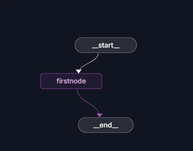
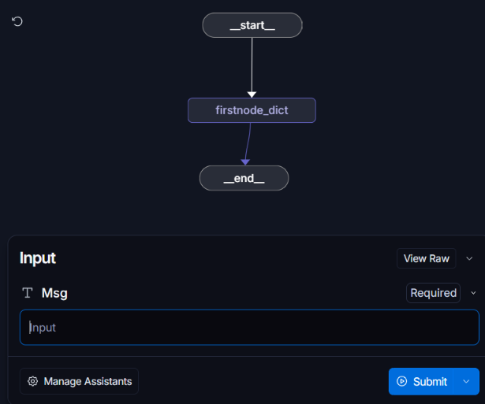
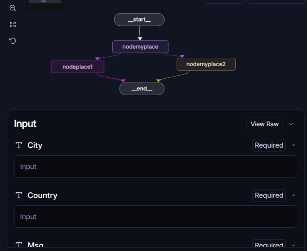
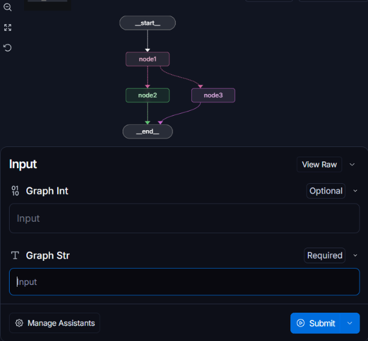
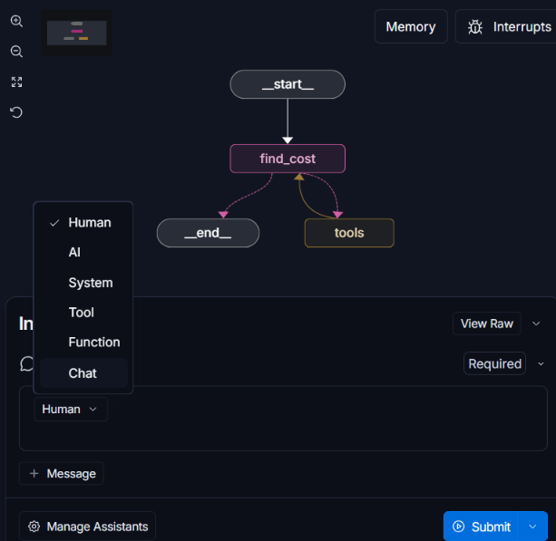

# LangGraph — Core Concepts, Built From Scratch

Every script in this repo was written by me, from scratch, while I learned LangGraph's foundational concepts. No boilerplate, no copied templates — I wrote each file myself and can walk through exactly what it does and why, because I built it that way on purpose 👏.

Getting through these fundamentals solidly gives me real confidence going forward. It tells me I can take on larger systems on my own, and that's exactly the motivation driving what comes next.

This repo is the starting point, not the destination. From here I'm moving into real-time multi-agent systems and full-stack applications built on LangGraph. Progress will continue to be logged here and on [LinkedIn](https://www.linkedin.com/in/r-thivisha) 👀.

---

## What's Inside:👇

| File | Concept |
|---|---|
| `0_langgraph.py` | Basic graph structure |
| `1_langgraph_dict.py` | State as a dictionary |
| `2_langgraph_2nodes.py` | Multiple nodes & branching |
| `3_langgraph_modelcall.py` | LLM integration |
| `4_langgraph_tools.py` | Tool calling & human-in-the-loop |

---

### `0_langgraph.py` — Basic Graph
- Establishes the foundational pipeline: a single node wired between `__start__` and `__end__`
- Covers how nodes and edges connect
- Covers how execution flows through a graph

### `1_langgraph_dict.py` — Dictionary State
- LangGraph requires state to be passed as a dictionary — a built-in constraint of the framework, not a design choice
- Demonstrates state being passed and accessed in that required format

### `2_langgraph_2nodes.py` — Multiple Nodes & Branching
- Introduces multiple nodes and conditional branching
- Routes to different nodes based on state (here, `City` and `Country` inputs) instead of following a single linear path

### `3_langgraph_modelcall.py` — LLM Integration
- Calls an LLM directly from within the graph
- Routes conditionally between nodes based on the model's output
- First step toward the graph making decisions rather than just executing them

### `4_langgraph_tools.py` — Tools & Human-in-the-Loop
- Adds tools so the LLM can act on a user's query, not just respond to it
- Tool calling is not hardcoded — the LLM decides whether a tool is needed based on the query
- Introduces human-in-the-loop control over the graph's execution

---

## What I'm Building Next:💪

### Multi-Agent Systems
- Multiple specialized agents coordinating through a shared graph, each handling a distinct sub-task
- Real-time agent-to-agent communication and state handoff

### Full-Stack Applications
- LangGraph backends wired to actual frontends, not just Studio/CLI runs
- Deployed, user-facing apps rather than isolated scripts

### RAG Pipelines
- Retrieval-augmented graphs that ground LLM responses in external documents/data

### Advanced Agent Architectures
- Deeper human-in-the-loop patterns, memory, and interrupts beyond what's shown here

Consecutive projects are waiting for me 😄!!!
